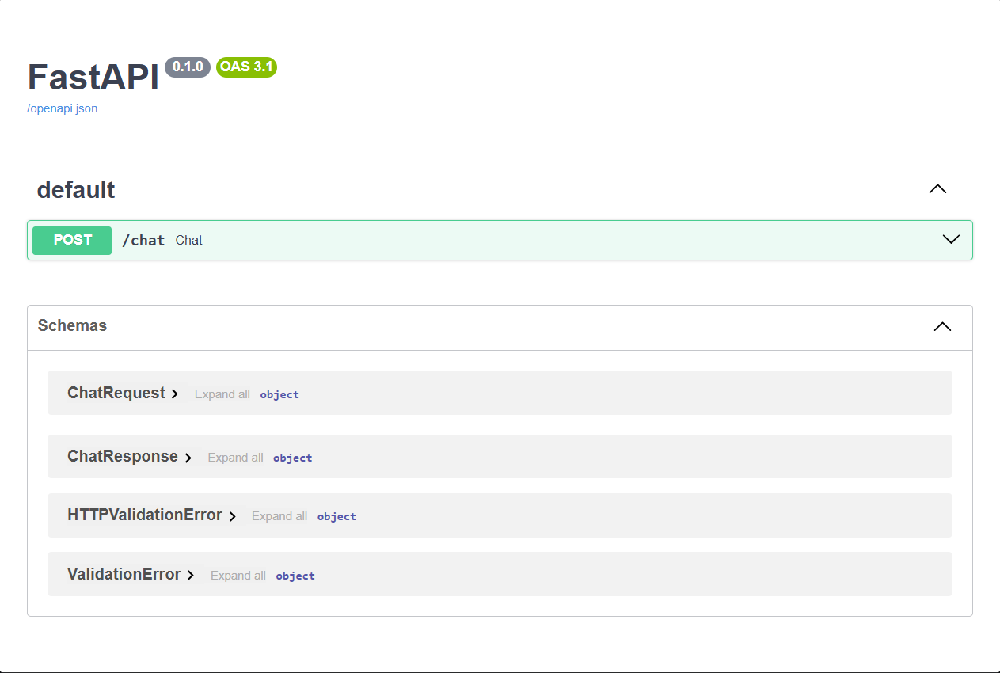
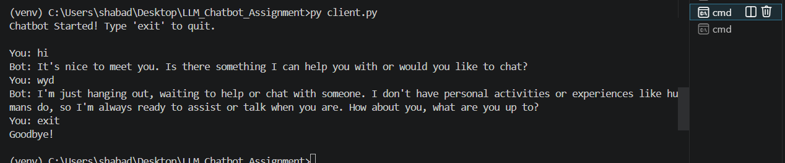
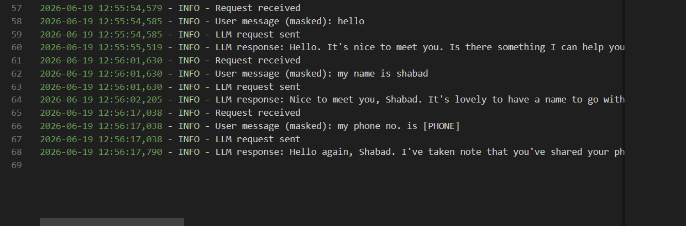
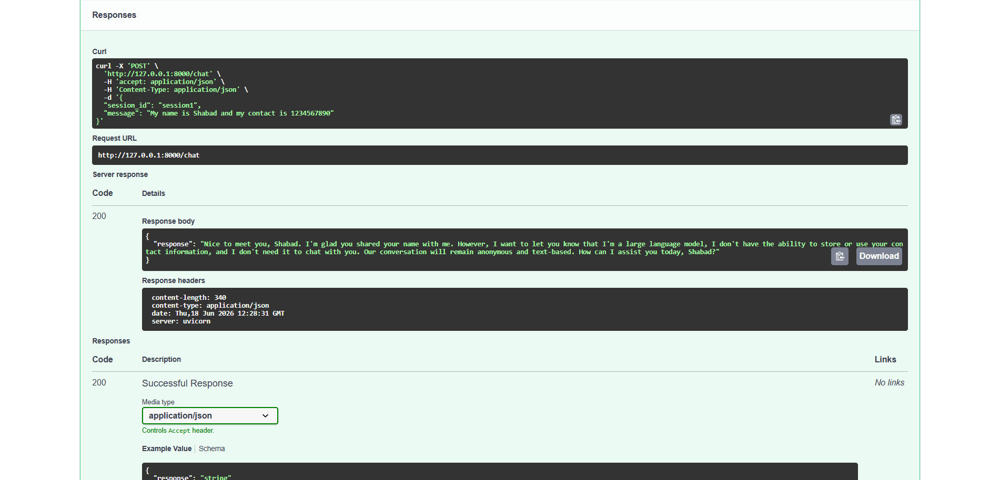

<div align="center">

# LLM Chatbot Assignment


A professional, robust chatbot built with FastAPI, LangChain, and Groq LLM, featuring PII masking and context-aware conversation memory.

</div>

---

## 📖 Description

This repository contains a fully functional, production-ready LLM chatbot. It uses FastAPI for the backend service, LangChain for handling conversation memory and prompt formatting, and Groq as the fast LLM provider. The project includes regex-based PII masking to ensure sensitive data is not passed to the LLM, and comprehensive logging for auditing and debugging.

### ✨ Key Features
- **FastAPI Backend:** High-performance, asynchronous REST API.
- **Groq Integration:** Ultra-fast LLM responses using LangChain's Groq integration.
- **Conversation Memory:** Contextual chat handling for multi-turn conversations.
- **PII Masking:** Automatic detection and masking of sensitive information using regex.
- **Robust Logging:** Detailed request and response logging.

---

## 📸 Demo

### Live API
*(Deployment coming soon)*

### Swagger UI


### Terminal Chatbot


### Logs


### API Response


*(Note: Replace placeholders with actual GIFs/screenshots)*

---

## 🏗 Architecture

The system follows a modular architecture separating the API routing, business logic, and LLM integrations.

[View the Architecture Diagram](docs/architecture.md)

---

## 🔄 Request Lifecycle Workflow

The following outlines the lifecycle of a single user request from API ingestion to response.

[View the Workflow Diagram](docs/workflow.md)

---

## 🚀 Getting Started

### Prerequisites
- Python 3.11+
- Groq API Key

### Installation

1. Clone the repository:
   ```bash
   git clone https://github.com/yourusername/LLM_Chatbot_Assignment.git
   cd LLM_Chatbot_Assignment
   ```

2. Create a virtual environment and activate it:
   ```bash
   python -m venv venv
   source venv/bin/activate  # On Windows use: venv\Scripts\activate
   ```

3. Install the dependencies:
   ```bash
   pip install -r requirements.txt
   ```

4. Create a `.env` file in the root directory and add your Groq API key:
   ```env
   GROQ_API_KEY=your_groq_api_key_here
   ```

### Running the Application

Start the FastAPI server:
```bash
uvicorn app.main:app --reload
```

Run the terminal client:
```bash
python client.py
```

---

## 🌐 Deployment Preparation

This project is structured for easy deployment to platforms like Render, Railway, or Heroku.

**To deploy this repository, the following additions are recommended:**
- **Procfile**: Required by many PaaS providers to specify the start command. Example: `web: uvicorn app.main:app --host 0.0.0.0 --port $PORT`
- **Python Runtime Version (`runtime.txt`)**: Explicitly define the Python version (e.g., `python-3.11.x`).
- **Environment Variables**: Ensure `GROQ_API_KEY` is securely set in your hosting platform's environment settings.

---

## 🏷️ GitHub Repository Metadata Suggestions

To optimize this repository for search and discovery on GitHub, consider updating your repository settings with the following:

- **Description:** "A production-ready LLM chatbot built with FastAPI, LangChain, and Groq, featuring PII masking and context-aware conversation memory."
- **Topics/Tags:** `python`, `fastapi`, `langchain`, `groq`, `chatbot`, `llm`, `regex`, `pydantic`, `api`, `logging`

---
