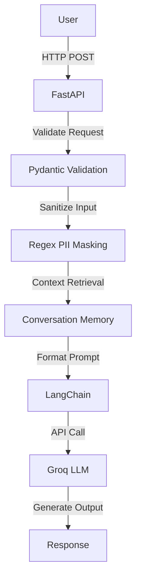

# Architecture Diagram

```mermaid
graph TD
    A[User] -->|HTTP POST| B[FastAPI]
    B -->|Validate Request| C[Pydantic Validation]
    C -->|Sanitize Input| D[Regex PII Masking]
    D -->|Context Retrieval| E[Conversation Memory]
    E -->|Format Prompt| F[LangChain]
    F -->|API Call| G[Groq LLM]
    G -->|Generate Output| H[Response]
```
