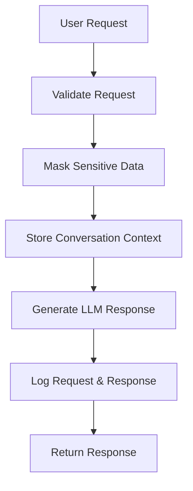

# Request Lifecycle Workflow

```mermaid
graph TD
    A[User Request] --> B[Validate Request]
    B --> C[Mask Sensitive Data]
    C --> D[Store Conversation Context]
    D --> E[Generate LLM Response]
    E --> F[Log Request & Response]
    F --> G[Return Response]
```
